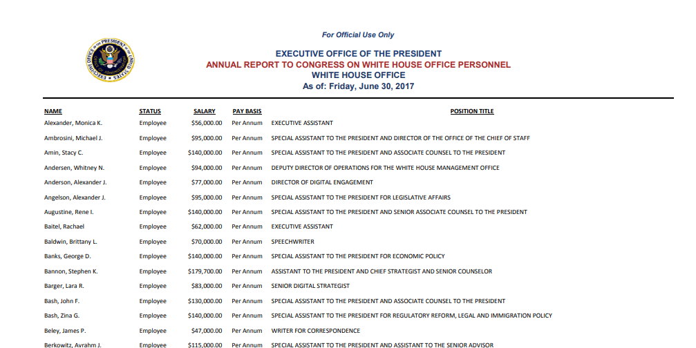
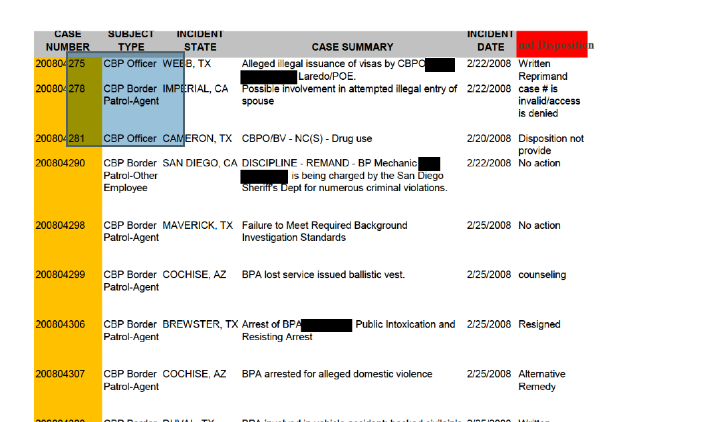
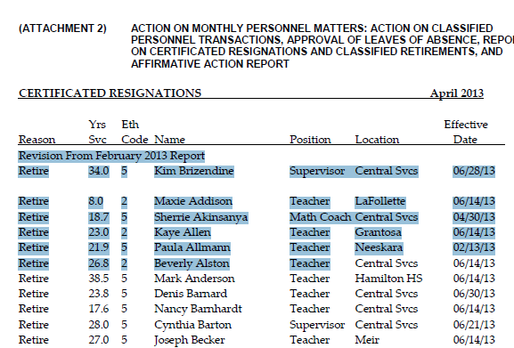

Adobe Acrobat PDF has become a common format for government officials to distribute reports and even data. They like it because they can read it -- there is no need for anyone to understand a computer program like Excel. They also think that there is no way you can manipulate the data. It's become a common way to transfer documents across the bureaucracy and present them to the public.

The problem is, copying and pasting from a pdf almost never works. The idea of a pdf is that every pixel is positioned on the page based on instructions inside the document. They aren't really the nice commas and rows that we see on the page.

Consier this pdf, President Trump's first report to Congress on White House employee salaries. It looks like this in the pdf:

If you try to copy and paste the text, it looks like this:

    NAME STATUS SALARY PAY BASIS POSITION TITLE
      Alexander, Monica K. Employee $56,000.00 Per Annum EXECUTIVE   ASSISTANT
      Ambrosini, Michael J. Employee $95,000.00 Per Annum SPECIAL ASSISTANT TO THE PRESIDENT AND DIRECTOR OF THE OFFICE OF THE CHIEF OF STAFF
      Amin, Stacy C. Employee $140,000.00 Per Annum SPECIAL ASSISTANT TO THE PRESIDENT AND ASSOCIATE COUNSEL TO THE PRESIDENT

This means you need a special tool to help you convert it into something Excel will understand.

## Is it text or an image?

The first question you have to ask yourself about a PDF is whether, underneath the pretty pretty picture, there is actual text.  Scanned documents start out as images.  If all you can do is select a region or the page, you likely have a PDF.

Image example:

If you have an image, you'll need to buy or use a product to try to recognize the image into text -- it's an inexact process, and you should be prepared for many hours of cleanup. Rob Barry of the Wall Street Journal created [this tutorial](https://github.com/sarahcnyt/stabile/blob/master/pdf/extracting_image_pdfs.pdf) for dealing with image pdfs using the paid product called Abbyy FineReader, which costs around $100.

Text example:

If it's text, you might get lucky and it will be a relatively easy conversion.

## Tools for converting pdfs

Rob Gebeloff at The New York Times compared the various PDF tools in [this tutorial](pdf_wrangling-gebeloff.pdf).

My strategy for converting pdfs is to use everything available to me, starting with the easiest and working my way up to the most complicated.

Here, we'll start with the free tools and tools you would be likely to have in a newsroom, and then work up to specialized products that cost some cash.

We're going to try the tools on a few example datasets (they're shortened to a few pages to make it easier)

### Cometdocs

As an IRE member, you have a free upgrade to a professional license for [cometdocs.com](https://www.cometdocs.com/).  To convert a pdf, you simply upload it from your computer, give them your email address, and wait for an excel file to be returned to you.

Sometimes it's great, sometimes it's awful.

### Tabula

Tabula  ([tabula.technology](http://tabula.technology/))is a product you install on your computer that works in your browser. It was created by and for journalists with the help of the Knight and Mozilla foundations.

Before you install, make sure there is a modern version of Java installed on your computer. It's required -- it won't work without it.

Tabula looks for tables in your document, but you can define them yourself if the guesses aren't right. It also allows you to apply the template to all or some of the other pages in a document and save it for future versions of the same document.

You can't adjust Tabula's guesses. It looks for white space and lines in the page to guess where to make the breaks. In may cases, those guesses are just fine. In others, they don't work at all.

### Adobe Acrobat Pro

Adobe Pro is good for two things:

* Optical Character Recognition: This is the process of going from image to text.
* Copying and pasting small tables from a long document into Excel.

### Able2Extract

Able2Extract from [Investech](https://www.investintech.com/prod_options.htm) is one of the only tools that lets you adjust and modify your output rows and columns. It has fewer options than some of the high-end programs, but it's still better than having to use default options. It costs around $150.00 and is available for both Mac and Windows.

### Abbyy FineReader and OmniPage

These are products mainly geared at extracting text from images, but they have powerful ways for you to export the results. One of the more powerful is to extract just text exactly as it was laid out on the page. That way you can use other tools to pull apart the text based on its position.

Omnipage is more powerful, but it's only available on Windows platforms.
