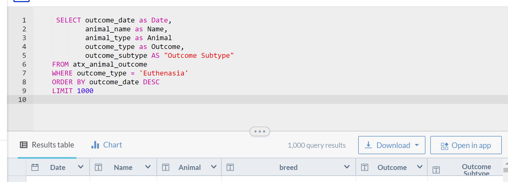
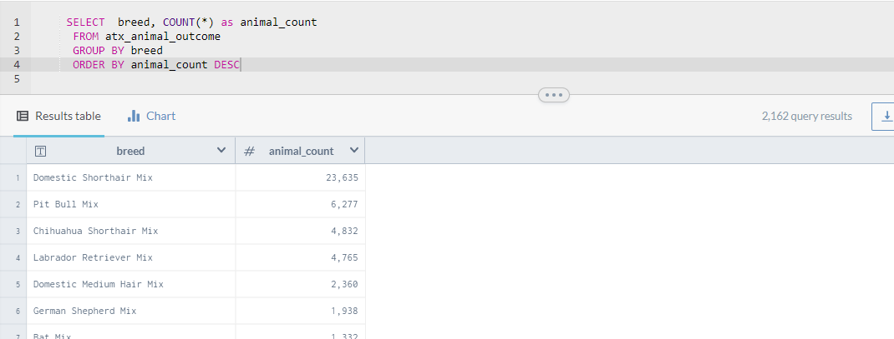
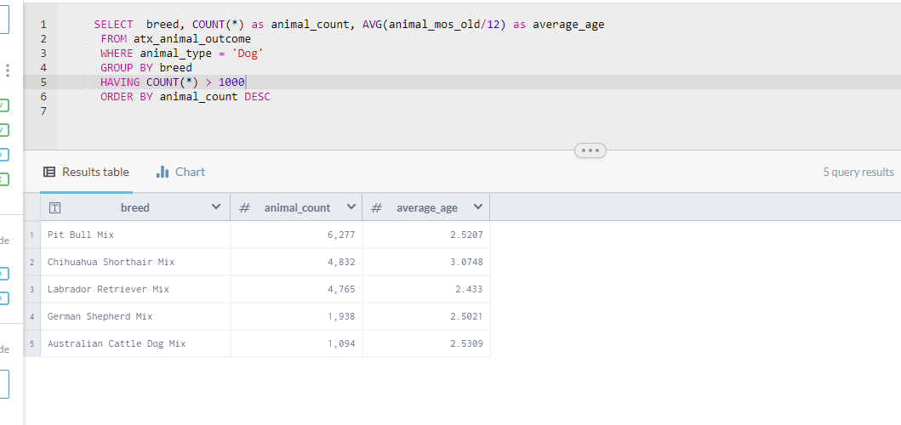
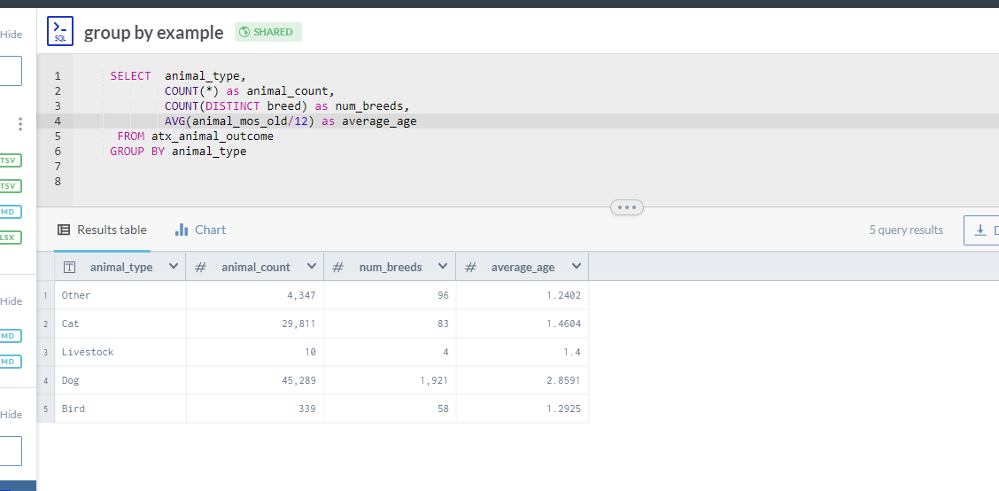

SQL queries can be far more sophisticated and targeted than the ones you made in Excel.

### Filtering in SQL

Unlike Excel, you usually save your questions, not your answers, in SQL. You can filter **vertically** by selecting only the columns (fields) you want to see, without changing the original data. You can filter **horizonally** by writing WHERE statements to limit the rows to your criteria.

The key words you need are:

    SELECT [your list of columns or fields]
      FROM [your table name]
      WHERE [a column ] = 'YOUR VALUE'
      ORDER BY [a column]
      LIMIT [number of rows]

#### The SELECT statement
Example 1:
This query selects all the most recent 1000 animals
You can rename columns as you select them, but you have to use the original name in the WHERE statement.

 

  Traps:
  * The list of fields you want to see is separated by commas, but there should be no comma after the last one. If you get an error that says there is something wrong near the keyword "FROM", check to see if you have an extra comma.
  * You have to know how the words are spelled in the database. It doesn't matter how words are spelled in the rest of the world.
  * Any time there is a space or any other special character in a field name, you have to enclose it in a single backwards quote.

#### The WHERE statement

The WHERE statement contains your criteria, which can become quite complex. The key words are:

**AND**: Both or all criteria must be true. It narrows your net so fewer fish get through.

     animal_type = 'Dog' AND outcome_type = 'Euthanasia'

**OR**: Either criteria must be true. It widens your net so more fish get through.

    animal_type = 'Dog' OR breed = 'Bat'

**IN**: A list of values, equivalent to a string of "OR" statements on the same field.

     animal_type IN ('Dog', 'Cat')

**NOT**: Usually reserved for use with AND, specifies that the following condition cannot be true. (You can also use != in data.world to mean "not equal to")

     animal_type = 'Dog' AND NOT breed='Labrador'

**IS NULL / IS NOT NULL**: Only missing values, or only filled in values

    animal_type = 'Dog' and breed IS NOT NULL

**LIKE**: Wildcard criteria, with % signs wherever you don't know what characters might exist.

    animal_type = 'Dog' AND breed LIKE '%Labrador%'

#### Traps
* "AND" vs. "OR" can be confusing. It's exactly the opposite of what we say. If we want  a list of dogs and cats, it's OR. If you're working on one field, it's rare to have an AND statement.

* Search for what is in the database, not for what you want to see. This can become confusing with plural vs. singular. If you want dogs, you must search for "Dog" if that's where it is in the query.

* Different flavors of SQL use quotes differently. You're usually safe if you use a single quote, as in *'*

* NULL means nothing. Null values are ephemeral. They are neither larger nor smaller than any other value. They're not equal to anything, even another null.

## Summarizing

Summarizing in SQL is like making pivot tables in Excel. You are grouping things together and counting, summing, averaging or determining the highest or lowest value.

#### The GROUP BY statement

Put values into piles using the GROUP BY and count the number of records in the pile using COUNT(\*). This query shows the most popular breed.

Every field in your SELECT statement that you want to show MUST be in the GROUP BY line. Don't fight it. Just do it.

If you want to limit your analysis to only some rows, use a WHERE statement before the GROUP BY. If you want to filter **after** the summary is done, use a HAVING statement

You can use SUM, AVG, MAX, MIN as calculated values, usually only on numeric or date fields. COUNT(\*) means "How many rows?". COUNT (DISTINCT breed) would mean, "how many different breeds are in this summary?"

#### The ORDER BY statement

You sort by whatever field, either ASCENDING (ASC) or DESCENDING (DESC).
To see the breed with the most rescues,

        SELECT breed, COUNT(*)
        FROM animals
        GROUP BY breed
        ORDER BY COUNT(*) DESC

## Date math in SQLite

Unlike other systems, SQLite has no data type that works with dates. In order to find the difference between dates, you need to convert date values into a number that can be added and subtracted. As long as your dates arrive as a standard format, as in "2017-01-01", it's not that hard.

1. Convert the date text into a date number using JULIANDAY function. (Don't worry about what it means. It's a very large number that calculates the number of days since the 4713 BC. It started with astronomers.)
2. Do some math, and convert to an integer.
3. If you want to calculate something off of today's date, use the built-in variable called 'now'

**EXAMPLE**

      JULIANDAY('now') - JULIANDAY(dob)

Gives you the number of days old

      (JULIANDAY('now') - JULIANDAY(dob)) / 365

Gives you an approximate number of years. To get it as the number of years without a decimal point:

       CAST ( (JULIANDAY('now') - JULIANDAY(dob)) / 365  as INTEGER )
