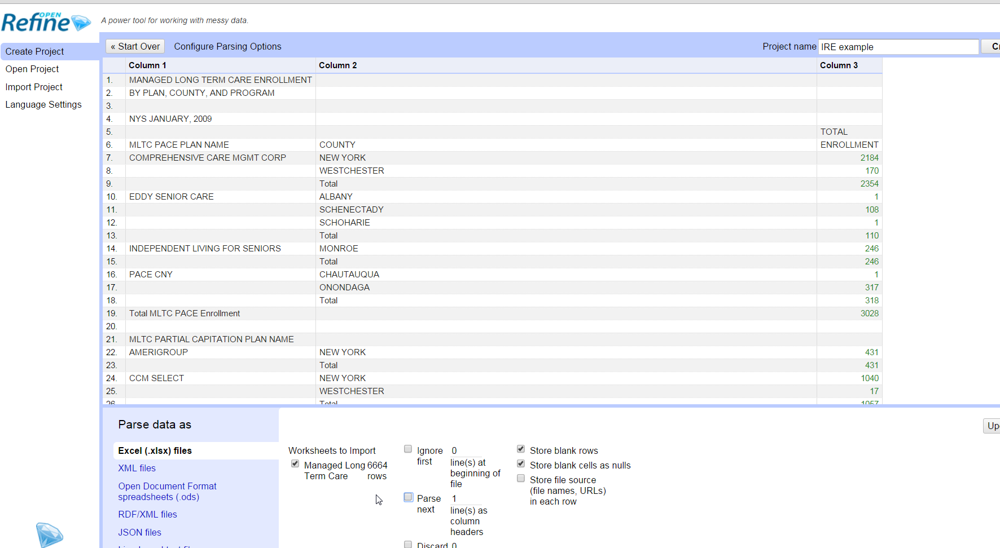
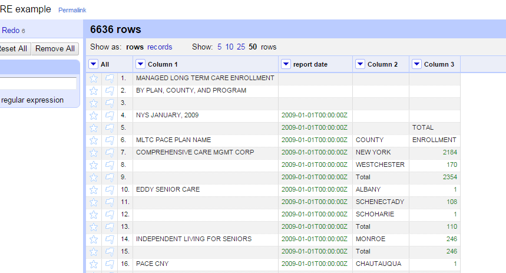
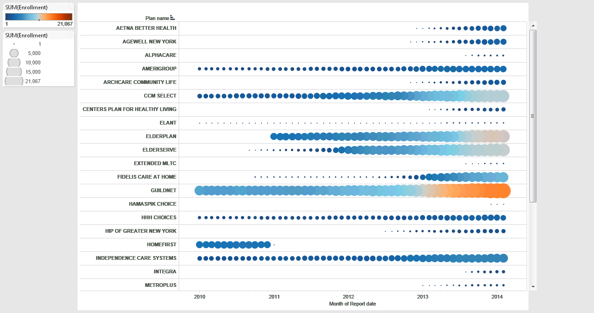

# Advanced data cleaning with OpenRefine
Sarah Cohen / sarah.cohen@nytimes.com / Denver CAR 2016

This tutorial walks through a cleanup of a spreadsheet compiled from the Medicaid long-term managed care reports from New York State.  This data was only going to be used for a few minutes as a way to determine which company would make a good subject based on its growth and size.  It wasn't worth a lot of work and using OpenRefine and regular expressions made a quick job of it.

If you want to practice regular expressions outside of OpenRefine, try [Regex 101](https://regex101.com/#python)

The original data is :
[https://www.health.ny.gov/health_care/managed_care/reports/enrollment/monthly/](https://www.health.ny.gov/health_care/managed_care/reports/enrollment/monthly/)

Each month is a separate workbook that also had some extraneous information. I combined all of the individual sheets we needed into one huge spreadsheet using [KuTools](http://www.extendoffice.com/product/kutools-for-excel.html), a utility available  for Windows versions of Excel.

The spreadsheet, called [all-longterm-managed-care.xlsx](https://github.com/sarahcnyt/data-journalism/blob/master/openrefine/all-longterm-manged-care.xlsx?raw=true) is in this folder.

For future reference, Arcadia Falcone has created a [cheat sheet](http://arcadiafalcone.net/GoogleRefineCheatSheets.pdf) for regular expressions in OpenRefine, but there are lots of other cheat sheets out there. Each language has a slightly different implementation, but the general idea stays the same.

### Examine the spreadsheet and envision success

It's easier to scroll through a spreadsheet in Excel than in OpenRefine, so take a good look at what you have. You should notice:

* It's out of order but can't be sorted.
* The format of certain items changes over time.
* It's far from "tidy".

Now, envision success. What would it look like if it had what you wanted? Each row would be filled out with data, and it might include:

* The date (like January 2009), in sortable form.
* Type of plan. In this case, it's "PACE" vs. "Partial capitation". Don't worry what they mean for now, just notice there are two types of plans on the spreadsheet.
* Name of plan
* County or area (NYC)
* Enrollment.

You might also want to preserve some of the totals to check your work. In this exercise, we'll only choose the statewide total by company for each month, not the total of all the plans.

### Import into OpenRefine ###

Create a new project and import this spreadsheet, but do not let OpenRefine use the first row as the field names.

When you first open the file, it will show up as "Records", not "Rows". The difference is that any item that has nothing in the first column is assumed to be part of the record above it. The first column determines whether it's combined.

Look at the row numbers on the left. You can see what it is considering a "record" vs. a "row".

I happen to know that there is a problem in some of the records that becomes confusing later on. Using the drop-down menu on Column 2, create a **Text filter** and search for "UPSTATE TOTALS". You should find 7 records, which you can then delete using the leftmost column **All->Edit rows->Remove all matching rows**).

This shows one of the most powerful parts of OpenRefine: it only acts on rows or records that are showing, not those that are unselected. You're going to use that to your advantage later on.

Remove or reset the filter and switch to **Show as: rows** . You should have 6,636 rows.

### Your first regex: Extract the report month and year

#### Find the right rows

When you looked at the spreadsheet you might have noticed that the month and year of the report date have several different formats. Sometimes the cell looks like "NYS JANUARY, 2009". Sometimes it looks like "NYS, FEBRUARY 2014" and other variations.

This is a good opportunity to see how a regular expression works. In OpenRefine, you can use regular expressions in filters or in cell transformations. This time we'll use a filter on Column 1. (Don't forget to turn Row mode on instead of Record mode)

Make sure to select "case sensitive" and "regular expression" options on the filter.

A regular expression is a *pattern*, which means you can be less specific than in a typical search-and-replace. We'll use two types of patterns here: A wildcard (.*), meaning any character repeated any number of times -- or not at all -- and a special character type for whitespace (\s) and digits (\d):

Our pattern looks like this:

			\s*NYS.*\d{4}

An asterisk next to a part of the pattern means "some or none" of the previous character. So \s* means there can be whitespace (tab, space, etc.) before the first word, and .* means we don't care what comes between NYS and some digits, so long as it's followed by exactly four digits (\d{4})

Once you're confident you have all of the date rows isolated and filtered, use **Edit column->Add column based on this column** to create a date field.

Remove your filter and use **Edit cells->Fill down** to fill in all the rows.

#### Create a consistent format

We're now going to use the regular expression to extract the month and year of the date. Then we can turn it into a true date field that can be sorted when you're done.

To change the values, use **Edit cells->Transform** . Using regular expressions in this calculator box is different than using them in the filter. Specifically, you have to provide wild cards on either side of your regular expression. They're not assumed they way they are in other languages and in the filter. They also require you to include a "/" at the beginning and end of the expression, which is NOT in quotation marks. (The "/" is pretty common as a way to start and end regular expressions in other languages.)

I'm not creating a new field, since I can always use the Undo/Redo menu in this case to re-extract my dates if I mess up.

We're going to use a *capture group* in the regular expression to extract the name of the month and the year. A capture group is something enclosed in parentheses that you want to use over again. It's the piece of the pattern that, in this case, you want to keep.

Use the same method for the next steps.

We'll use a  *character class* - some characters enclosed by brackets -  to look for any combination of spaces and commas.

				[, ]+
				means one or more commas, spaces or any combination of them.
				The + is used instead of a * to indicate that at least one of these characters must be found.

				Another examples of a character classes is
				[A-Za-z0-9]
			    (any letter or number)

The function for OpenRefine's regex matching is called match. In this case, we're using the value in the same column, so it's

				value.match(/pattern/)[which match]
				(Put an "i" after the slash if you want it to ignore the case.)

Try to piece this one together. The [0] at the end tells you which of the items in parentheses to keep. In this case, there is only one, so it's the first one. Remember that .* means "anything or nothing", and [, ]+ means at least one comma or space or any combination.

Now you can use the same idea to replace the various combinations of commas and spaces between the month and year by using a similar command:

			value.replace(/[, ]+/, ' ')

Finally, let's turn this into a real date:

			value.toDate('MMM yyyy')
			(be very careful. If you use YYYY it will be wrong.)

With a couple of commands you now have a consistent date field, which later on can be sorted. (Don't try it yet!)

Although we did this step by step, many of these steps could have been combined into just one or two. You could have captured the date at the same time as making the new column, and you could have created the date at the same time as replacing the commas.

### Your second regex: Using anchors and an "OR" condition

Our second field is one that shows us what kind of plan the item is -- PACE or Partial Capitation. (Don't worry what they mean. It's two different ways of paying.)

Sometimes you need to anchor your regex to the beginning or end of the string, and sometimes you want to use an "OR" condition -- as in PACE OR PARTIAL....

An "or" in a regex is the vertical bar "|". Anchoring to the beginning of a field is a caret (^) and the end is a dollar sign.

Make sure you have a filter on Column 1, with the case sensitive and regular expression boxes checked. Try to make the regular expression yourself before looking at the screen shot.

Try it without the anchor and see what you get. (You should see "Total MLTC PACE..."

Once you have the rows showing that you want, use the Column 1 menu item **Edit column -> Add column based on this column**, extracting out only the words you want using parentheses to capture the words.

Walking through this expression:

* value.match  is the function, "match", acting on the "value" of this column. You could make it work on another column by saying, for example, cells["Column 2"].value.match
* **/.../** creates the regular expression
* .*  (period-asterisk) says "anything or nothing"
* MLTC searches for those exact uppercase letters,  in order.
* (PACE|PARTIAL CAPITATION) are the words we want to extract into the new column -- this is the capture group.
* .*  means "anything or nothing" again. In OpenRefine expression boxes, you don't use anchors the way you did in the filter. Instead, you have to use wildcards to avoid an implied anchor at both ends.
* [0] tell Refine to use the first capture group as the answer. (All the captures are returned as an array or list of items, even if there is only one.)

### Clean up on your own.

Before we go any further, create a column based on Column 1's value -- this will be our final plan name column, but we don't want to wreck the "record" vs. "row" idea. I called it **plan name**.

The next steps are pretty straightforward.

* Fill down the new column.
* Filter for rows you want to delete so you have just the rows with the names of counties and the county totals for a company left.
* You'll probably want a regular expression to find the footnotes. In order to use the character "(", you have to escape it with a backslash:

			\(\d+\)
			finds (1) or (37) but not (a)

* you can probably use the easier facets for finding empty rows and titles.

The filters I used were the ones for the original dates we found in step 1, MLTC, Note, BY PLAN, Total Statewide and a few more. You'll see them pretty quickly. I got 5526 rows after deleting, but there are actually still a few extra rows in there -- you might have caught them.

### More on records vs. rows

We have one last job to do: Get the company totals into another column, and then "fill up" instead of "fill down." The problem is that Refine has no "fill up" function. That's where records come in.

* Filter or facet to show the Total rows in Column 2, then create a new column based on Column 3. Remember, the idea is to get the totals next to the detail rather than below it.

* Switch to **Show as: records** instead of rows. You should see that OpenRefine is changing the record after each entry in Column 1.

We need to apply all of the totals to each row within the company total. Under the company total column, choose a cell transformation to bring up the formula box. Here's the formula to put whatever is in the last row to all rows in the record:

			row.record.cells["company total"].value[-1]

			(The [-1] means "last" cell). If you called your total column something different, you'll need to use that name.)

Once you switch back to the row view, you can delete the Total rows.  (There are a few items that say WELLCARE and have no county on them -- they were blank rows in the original, and you can delete them)

### Congratulations! You now have tidy data!

... Almost.

On your own, try using the clustering ability in Open Refine to standardize the company names.

Here's the chart from Tableau that we used to choose the company.  (It turned out the 2008 data was spotty, so we started the analysis in 2010, and we limited it to those operating in New York City.)

