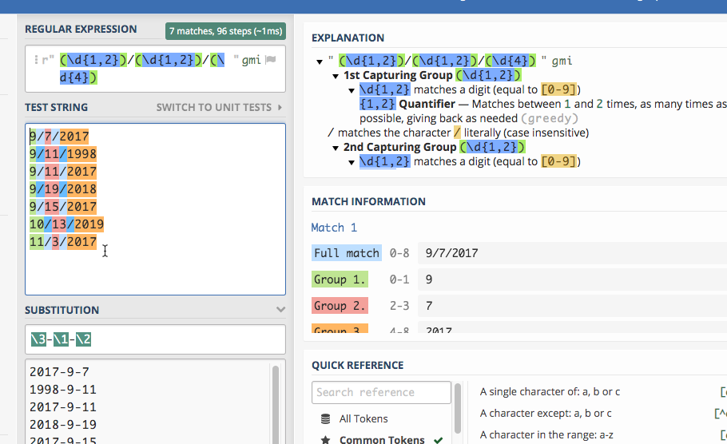

## Regular Expressions basics

*Regular expressions* are used to find and replace text based on *patterns* rather than *characters*. They're particularly useful when trying to pull apart and standardize variables in a database such as names, phone numbers and addresses to make grouping and joining more effective.

A human can easily discern that the name *John W. Smith, Jr.*  and *Smith, John W Jr* are probably the same. A computer sees them as completely different -- they don't start with the same characters, they have commas in different places, etc. A regular expression can help you pull apart names based on their pieces and then put them back together in another form.

There are up to three parts to a regular expression:

1. The pattern you are trying to find.
2. Options that control whether the pattern should be case-sensitive and how it handles line endings and wild cards. I usually turn off case-sensitivity but leave the other options alone.
3. An optional replacement, which could use part of what you've found in the original seeking phase.

In practice, you'll usually save the pieces of each pattern you've found into a variable, then put them back together differently.

[Justin Meyer had a good handout]({{site.baseurl}}/assets/docs/meyer_regex.pdf) at a recent IRE conference that can serve as a guide.  

If you're using R, you can use a regex using the stringr package (part of the tidyverse) using the functions *str_detect* , *str_extract* and their cousins. They look like this:  

    str_detect(var_name, regex("pattern"))  

### Pattern basics

While each language implements regular expressions (or "regex") a little differently, they are generally the same. You may need to look up how to reference these pieces in your language.

#### Literal strings

These are just letters, like "abc" or "Mary". They are case-sensitive and no different than using text in a filter.

You can tell the regex that you want to find your pattern at the beginning or end of a line:

    ^   = "Find only at the beginning of a line"
    $   = "Find only at the end of a line"

#### Wild cards

A wild card is a character you use to indicate the word "anything". Here are some ways to use wild cards in regex:

      .      = "any single character of any type"
      .?     = "a possible single character of any type (but it might not exist)"
      .*     = "anything or nothing of any length"
      .+     = "anything one or more times"
      .{1,3} = "anything running between 1 and 3 characters long"

Regular expressions also have wild cards of specific types. Usually, they are commonly used like this:

      \d   = "Any digit"
      \w   = "Any word character"
      \s   = "Any whitespace (tab, space, etc.)"
      \b   = "Any word boundary" (period, comma, space, etc.)

#### Character classes

Sometimes you want to tell the regex what characters it is allowed to accept. For example, say you don't know whether there is an alternative spelling for a name -- you can tell the regex to either ignore a character, or take one of several.

In R, we saw that there were alternative spellings for words like "summarize" -- the British and the American spellings. You could, for example, use this pattern to pick up either spelling:

        summari[sz]e

The bracket tells the regex that it's allowed to take either one of those characters. You can also use ranges:

      [a-zA-Z0-9]

means that any lower case, upper case or numeric character is allowed.

#### Escaping

Because they're already being used for special purposes, some characters have to be "escaped" before you can search for them. Notably, they are parentheses (), periods, backslashes, dollar signs, question marks, dashes and carets.

This means that to find a period or question mark, you have to use the pattern

        \. or
        \?

## Sample data

Here are three small text files that you can copy and paste from your browser into the [regex101.com](https://regex101.com/) site. It's a site that lets you test out regular expressions, while explaining to you what's happening with them.

1. A [list of phone numbers]({{site.baseurl}}/assets/data/special/regex_phones.txt) in different formats
2. A [list of dates]({{site.baseurl}}/assets/data/special/regex_dates.txt) that you need to convert into a different form.
3. A [list of addresses]({{site.baseurl}}/assets/data/special/regex_addresses.txt) that are in multiple lines, and you need to pull out the pieces. (Courtesy of IRE)
4. A [small chunk of the H2B visa applications]({{site.baseurl}}/assets/data/special/regex_h2bvisas.txt) from Arizona companies or worksites that has been kind of messed up for this demonstration, in tab-delimited format.

## A simple example

You should try following along in regex 101 for this part.

### Looking for specific words or characters

The easiest regex is one that has just the characters  you're looking for when you know that they are the right case. They're called *literals* because you are literally looking for those letters or characters.

If you weren't sure if it was upper or lower case, you could change the global pattern flags (to the right of the pattern) from "gm" to "gmi", which includes the instruction to IGNORECASE.

## Practice #1: Extract date parts

(In Regex 101, change the "Flavor" to "Python" -- otherwise, you have to escape more of the characters.)

We want to turn dates that look like this:

      1/24/2018

into something that looks like this:

     2008-1-24

Copy and paste these numbers into the regex 101 window:

    9/7/2017
    9/11/1998
    9/11/2017
    9/19/2018
    9/15/2017
    10/13/2019
    11/3/2017

First, you can use any digit using the pattern "\d". Try to do it in pieces. First, see if you can find one or two digits at the beginning of the line.

      ^\d{1,2}

Try coming up with the rest of it on your own before you type in the answer:

      ^\d{1,2}.\d{1,2}.\d{4}

(This works because regular expressions normally are "greedy". That is, if you tell it "one or two digits", it will always take two if they exist.)

      ^(\d{1,2}).(\d{1,2}).(\d{4})

Now each piece is numbered: \1 refers to the month, \2 refers to the day, and \3 refers to the year. Expand the "substitution" pane at the bottom of the screen, and try it:

## Practice #2: Extract pieces of phone numbers

Here are some phone numbers in different formats:

    623-374-1167
    760.352.5212
    831-676-3833
    (831)-676-3833
    623-374-1167 ext 203
    831-775-0370
    (602)-955-0222  x20
    928-627-8080
    831-784-1453

This is a little more complicated than it looks, so try piecing together what this one says:

      (\d{3})[-.\)]+(\d{3})[-.]+(\d{4})

(This won't work in the "substitute" area -- it would be easier to create a new variable with the results than to replace the originals.)

Anything within parentheses will be "captured" in a block.

## Practice #3: Extract address pieces

(This comes from "Regular expressions for the rest of us", from Christian McDonald of University of Texas, from the 2019 NICAR conference. [This exercise is a great primer on regular expression](../assets/docs/regex_for_rest_of_us.pdf).)

Here are a few lines of the data, which you can copy and paste to go through McDonald's exercise. (He uses the Javascript version of regular expressions, but for our purposes in this exercise, it doesn't matter which one you use. If you choose Python,  you'll have one extra step, of putting a slash (\\) before the quotes. The colors work a little better if you leave it on the default PHP method.)

    "10111 N LAMAR BLVD
    AUSTIN, TX 78753
    (30.370945933000485, -97.6925542359997)"
    "3636 N FM 620 RD
    AUSTIN, TX 78734
    (30.377873241000486, -97.9523496219997)"
    "9919 SERVICE AVE
    AUSTIN, TX 78743
    (30.205028616000448, -97.6625588019997)"
    "10601 N LAMAR BLVD
    AUSTIN, TX 78753
    (30.37476574700048, -97.6903937089997)"
    "801 E WILLIAM CANNON DR Unit 205
    AUSTIN, TX 78745
    (30.190914575000477, -97.77193838799968)"
    "4408 LONG CHAMP DR
    AUSTIN, TX 78746
    (30.340981111000474, -97.7983147919997)"
    "625 W BEN WHITE BLVD EB
    AUSTIN, TX 78745
    (30.206884239000487, -97.7956469989997)"
    "3914 N LAMAR BLVD
    AUSTIN, TX 78756
    (30.307477098000447, -97.74169675199965)"
    "15201 FALCON HEAD BLVD
    BEE CAVE, TX 78738
    (30.32068282700044, -97.96890311999965)"
    "11905 FM 2244 RD Unit 100
    BEE CAVE, TX 78738
    (30.308363203000454, -97.92393357799966)"
    "3801 JUNIPER TRCE
    BEE CAVE, TX 78738
    (30.308247975000484, -97.93511531999968)"
    "12800 GALLERIA CIR Unit 101
    BEE CAVE, TX 78738
    (30.307996778000472, -97.94065088199966)"
    "12400 W SH 71 Unit 510
    BEE CAVE, TX 78733
    (30.330682136000462, -97.86979886299969)"
    "716 W 6TH ST
    AUSTIN, TX 78701
    (30.27019732500048, -97.75036306299967)"
    "3003 BEE CAVES RD
    ROLLINGWOOD, TX 78746
    (30.271592738000436, -97.79583786499967)"

## On your own

[This is a small list of H2A visa applications](../assets/data/special/regex_h2bvisas.txt), which are requests for agricultural and seasonal workers, from companies or worksites in Arizona. Try writing some regular expression to extract diffrent pieces of it, since it's a fixed-width file.

Try importing it into Excel, then copying some of the cells to practice your regular expression skills. You might try

* Finding all of the LLC's in the list (limited liability companies) of names. (You should turn on the case-insensitive flag in Regex 101 or set that flag in your program if you do.)
* See how far you can get in standardizing the addresses.

Next week, we'll see how this can work in OpenRefine.
