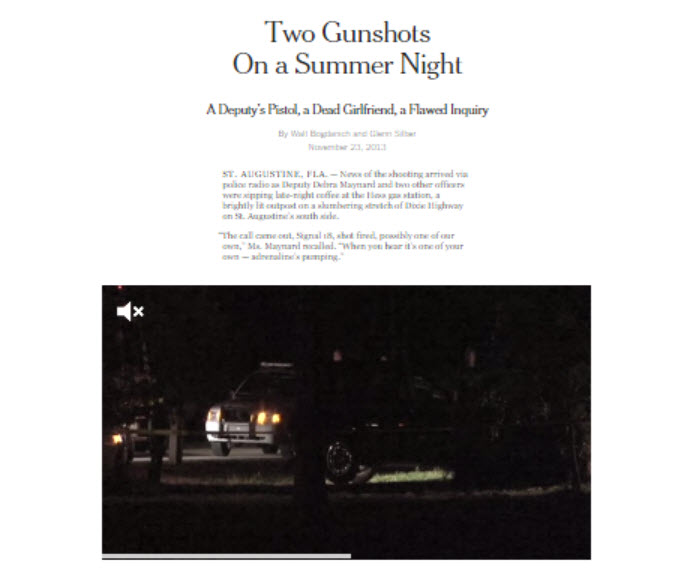
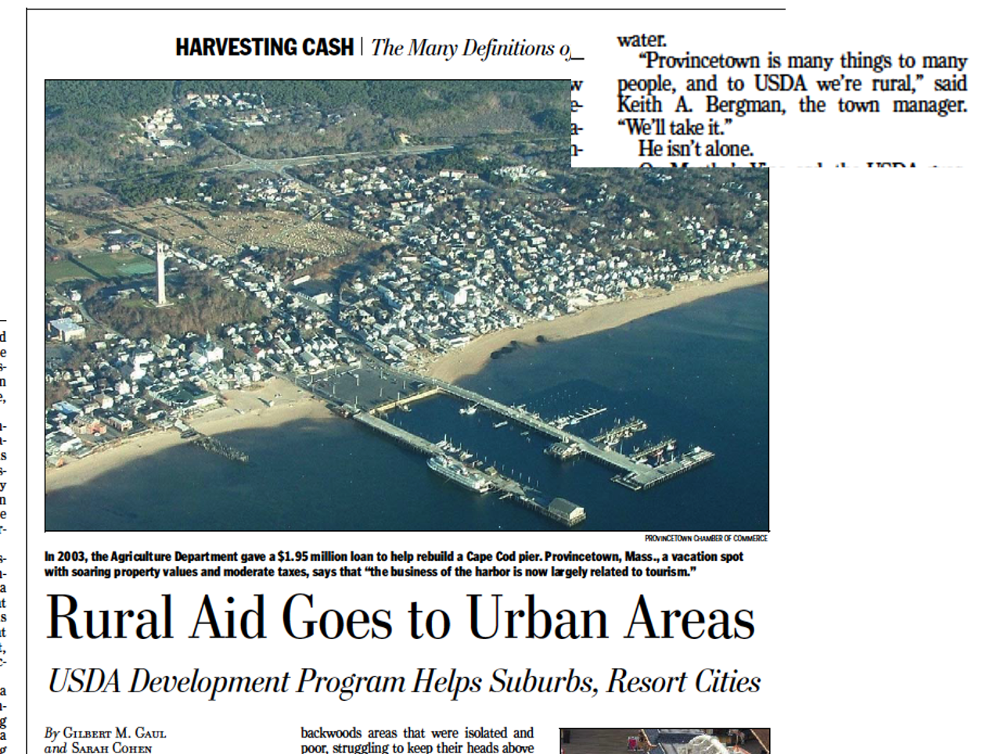
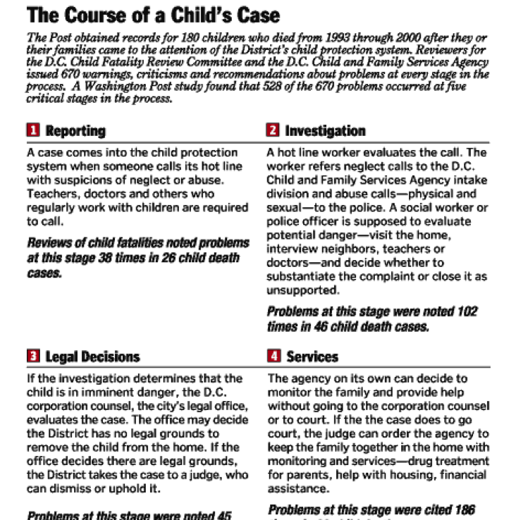

<blockquote>
<i>To trace patterns of abuse and neglect in Invisible Lives, to aid in the task of deducing the anonymous dead in Invisible Deaths, and to keep track of a vast number of documents from varied sources, I made, and learned to love, Excel spreadsheets.  
--  Katherine Boo, 2000 </i>
</blockquote>

<blockquote>
<i>Obscured behind the techno-babble is a simple truth: the best [data journalism] is born from the heart, not the machine
 
-- Michael Berens, 1999 </i>
</blockquote>

##  Preliminary Schedule

|      |      |
| --- | --- |
| 2:15 - | Introductions and warmup
| 2:30 - | The role of data ; cleaning cautions
| 3:00 -  | Data reporting for story: the promise of case level data.
| 3:30 - | Building your chronology for narrative.
| 4:00 - | Story structure - the big three
| 4:45 - | Wordsmithing - precision with action

## Time

Most stories that turn on narratives could be helped by creating your own data, especially a simple spreadsheet that can be sorted and filtered for exactly what you want.

Partway through the story, we turn from the case of Michelle O'Connell to show that this was not the first time that the county sheriff had declined to investigate accusations of domestic violence.

<blockquote style="font-size:80%;font-style:italic">
A year before that, Sheriff Shoar’s disciplinary posture had been called into question in a domestic violence case involving a deputy named Halford (Bubba) Harris II.
  
Two supervisors learned of accusations that Mr. Harris had abused his wife. But no investigation was immediately opened, records show.
  
One sergeant did prepare an affidavit documenting the accusations. But he was told by his supervisor to hold it back, so he stuck it under the visor in his squad car, where it remained, even after another officer became aware of further incidents, according to Mr. Harris’s internal affairs file.
  
The case came to a head on Christmas Eve, when his wife fled their house and called the police. Internal affairs officers uncovered other possible acts of domestic violence before his hiring, records show. His wife said that before they married, he had held a knife to her throat and hit her. His ex-wife said he had threatened her with a gun. No charges were filed.
  
Col. Todd R. Thompson, the sheriff’s director of law enforcement, recommended that Mr. Harris be fired, saying his actions were “particularly egregious and trouble me deeply.”
  
In an interview, Mr. Harris insisted that he had never engaged in domestic abuse: “Is there proof?”
  
“They’re telling one story,” he added. “I’ll tell you another one.” He said the state attorney brought no charges and noted that, though they divorced after the Christmas Eve incident, his wife later wrote a letter of support, calling him “a wonderful man and father.”
  
Sheriff Shoar overruled the dismissal recommendation, citing mitigating factors, like an “exemplary” work record and an absence of citizen complaints.
  
“I hope you understand how fortunate you are to receive a second chance,” the sheriff wrote to his deputy.
  
After the decision leaked out and caused an uproar, Mr. Harris said, he was pressured to resign. He is now a deputy in a nearby county.
</blockquote>

-- "[Two Gunshots on a Summer Night](http://www.nytimes.com/projects/2013/two-gunshots/index.html)"

Much of this passage came from a series of internal affairs reports done after the last incident.
[Here is one of them]({{site.baseurl}}/assets/docs/internal-affairs-report)

[Here is the spreadsheet]({{site.baseurl}}/assets/data/xlexamples/bubba_harris_protocol.xlsx) we made out of the report.

Characteristics that help you with writing:
* Include a fact-check and source column. Make sure you know if you can use the item.
* Use tags for people, places and topics, for filtering.
* Including timing notes so you don't get paralyzed when you don't know an exact date.

## Place

<blockquote style="font-size:75%;font-style:italic">
PROVINCETOWN, Mass. — In a few weeks, artists, lawyers and bankers will be- gin arriving here for the busy summer sea- son on high-speed ferries that take 90 min- utes to make the trip from Boston. They will land at a recently refurbished munici- pal dock that was built with the help of a $1.95 million low-interest loan from the U.S. Department of Agriculture.
  
A few blocks away, the Provincetown Art Association and Museum has used nearly $3 million in grants and loans from the Ag- riculture Department to add gallery space and renovate a historic sea captain’s house. A short drive back down the Cape, the de- partment is financing a new actors theater in Wellfleet and recently awarded a grant to a garden center in Hyannis to build a wind- mill.
  
Although Cape Cod is only a short trip from Boston and Providence, R.I., and is home to some of the wealthiest beach towns in the United States, to the Agricul- ture Department it meets the definition of rural America. That means it qualifies for aid originally intended for farmland and
backwoods areas that were isolated and poor, struggling to keep their heads above water.
  
“Provincetown is many things to many people, and to USDA we’re rural,” said Keith A. Bergman, the town manager. “We’ll take it.”
  
He isn’t alone.
  
On Martha’s Vineyard, the USDA guar- anteed a $4.5 million loan for the popular Black Dog Tavern. The loan, which has since been repaid, was to refinance the tav- ern’s mortgage and expand Black Dog’s re- tail clothing stores. On Nantucket, where the population swells to the size of a small city in summer months, the Agriculture De- partment provides rental subsidies for families priced out of the local market.
</blockquote>

This is an example of a story in which the central finding is difficult to understand until you know the details of the cases.

## Chapters

A typical structure when working in chapters is to find themes in the process that you're describing.  Take the process step by step, wherever the system can fall apart, and build a chapter around it. Sometimes include a map to the process for readers:

Examples:

* In Housing Court evictions, the process starts with a misuse of the filing system, which lets landlords file a case without any proof. This is the first chapter, with a strong place focus.
* Then, a process server is supposed to let you know you've been served. This is another chapter, about how they lie on the forms, including a place where a server claimed he'd gone to 22 homes in 5 minutes, which would have been across three buildings and more than 20 stories.
* The lawyers show up for the plaintiffs, but the defendants are helpless. The third chapter is on the chaos of the court.
* etc.

## The microcosm

Tell the entire story through a microcosm. This is often done by, for example, going through the history of a block or a building to show how something came about. Another way is to put a compelling example in a chronology.  But it can also be done using any great example. I once did a story (a very long time ago) about how candidate Obama had turned one-time donors into monthly or weekly donors, eventually eating up a good chunk of money from people who had very little. We told it using the microcosm of all student donors from one university, including quotes from people who didn't even realize they'd been giving so much.

## The firehose

I don't know what else this is called, but it's a way to do a story in which no single example is compelling, no microcosm or place works to tell the story, but it's useful to have an accumulation of examples that show how widespread (and usually inexplicable) the problem is. This often comes with money stories -- esp. the use of government money. Two examples of this from my time at the Post:

<blockquote>
In the aftermath of the Sept. 11, 2001, attacks on New York and Washington, lawmakers doled out the money quickly, with few restrictions and vague guidelines. Left to interpret needs on their own -- and with little regional coordination -- cash-strapped local and state officials plugged budget holes, spent millions on pet projects and steered contracts to political allies.

The District funded a politically popular jobs program, outfitted police with leather jackets and assessed environmental problems on property prime for redevelopment. In Maryland, the money is buying Prince George's County prosecutors an office security system. In Virginia, a small volunteer fire department spent $350,000 on a custom-made fire boat. The Metropolitan Washington Council of Governments used some of the money for janitorial services.

-- "[Anti-terrorism funds buy a wide array of pet projects](https://www.washingtonpost.com/archive/politics/2003/11/23/anti-terrorism-funds-buy-wide-array-of-pet-projects/35c61084-9ea6-42bc-a666-f1e6390b2a6d/)," Jo Becker, Sarah Cohen and Spencer Hsu, The Washington Post, November 2003.
</blockquote>

Parts of the story had examples of questionable spending and a little bit of favoratism, but none of it was compelling enough to drive an entire story.

Another example:

<blockquote>
In the five-year struggle to finish the war in Iraq, military leaders and their troops have said a particular weapon is among the most effective in their arsenal:

American cash.

Soldiers walk the streets carrying thousands of dollars to pay Iraqis for doorways battered in American raids and limbs lost during firefights. Sheiks appeal to commanders to use larger pools of money locked away in Humvees and safes at military bases for new schools, health clinics, water treatment plants and generators, knowing that the military can bypass Iraqi and U.S. bureaucratic hurdles.

Army documents show that $48,000 was spent on 6,000 pairs of children's shoes; an additional $50,000 bought 625 sheep for people described in records as "starving poor locals" in a Baghdad neighborhood. Soldiers ordered $100,000 worth of dolls and $500,000 in action figures made to look like Iraqi Security Forces. About $14,250 was spent on "I Love Iraq" T-shirts. More than $75,000 sent a delegation to a women's and civil rights conference in Cairo. And $12,800 was spent for two pools to cool bears and tigers at Zawra Park Zoo in Baghdad.
</blockquote>

-- "[Money as a Weapon](https://cronkitedata.github.io/cronkite-docs/assets/docs/cerp.pdf)" Dana Hedgpeth and Sarah Cohen, The Washington Post, August 2008. 
